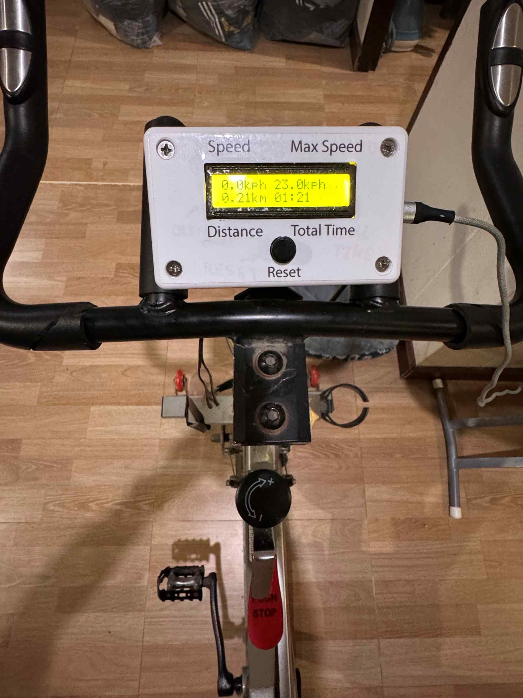
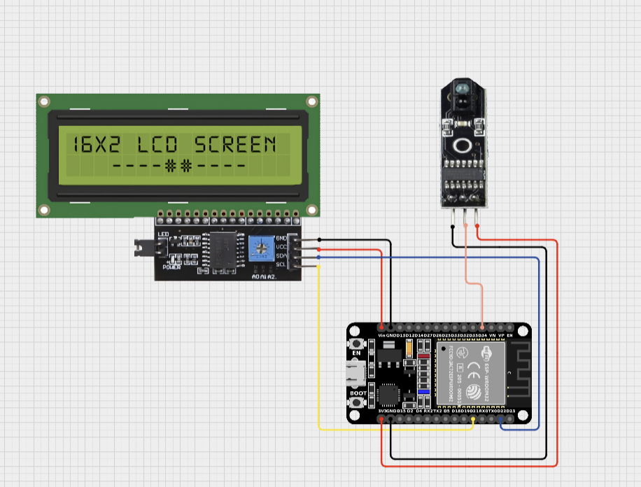
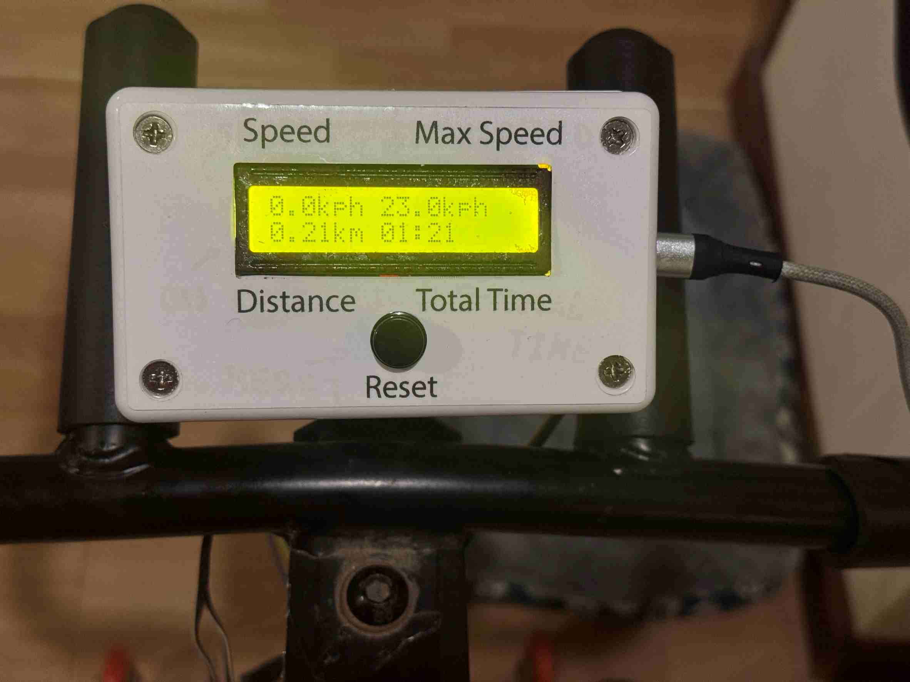

<h1>มาตรวัดความเร็วจักรยานแบบ DIY</h1>

จากมาตรวัดความเร็วของจักรยานแบบเดิม มันใช้งานไม่ได้นานมากแล้ว ผมอยากสร้างให้ กลับมาใช้งานได้อีกครั้ง
<h2>อุปกรณ์ที่ใช้:</h2>
<ul>
  <li>สายไฟจัมเปอร์</li>
  <li>ESP32 Board</li>
  <li>sensor ตรวจับเส้นดำ</li>
  <li>จอแสดงผล LiquidCrystal_I2C </li>
</ul>

<h2>หลักการทำงาน: </h2>
ถ้าเริ่มปั่นจักรยาน เซนเซอร์เจอเส้นดำเส้นแรก จะเริ่มจับเวลา คำนวณหาความเร็ว หน่วยเป็น กิโลเมตรต่อชั่วโมง และ ระยะทาง เป็นหน่วย กิโลเมตร พร้อมบันทึกความเร็วสูงสุด มีหน่วยเป็น กิโลเมตรต่อชั่วโมง  นำมาแสดงผลในขณะปั่นจักรยาน โดยให้แสดงผลที่จอ LiquidCrystal_I2C และถ้าต้องการ reset ค่าทั้งหมด กดปุ่ม reset เพียง 1 ครั้ง  จะสามารถ reset ให้ค่าที่แสดงเป็น 0 

<h2>สิ่งที่ได้เรียนรู้: </h2>
ได้เรียนรู้เกี่ยวกับการใช้งาน micros() หรือ millis() เพื่อนำค่าไปคำนวณหาค่าความเร็วที่ล้อหมุนได้ ในแต่ละรอบที่หมุนไป และเข้าใจหลักการรับ input output จากเซนเซอร์
